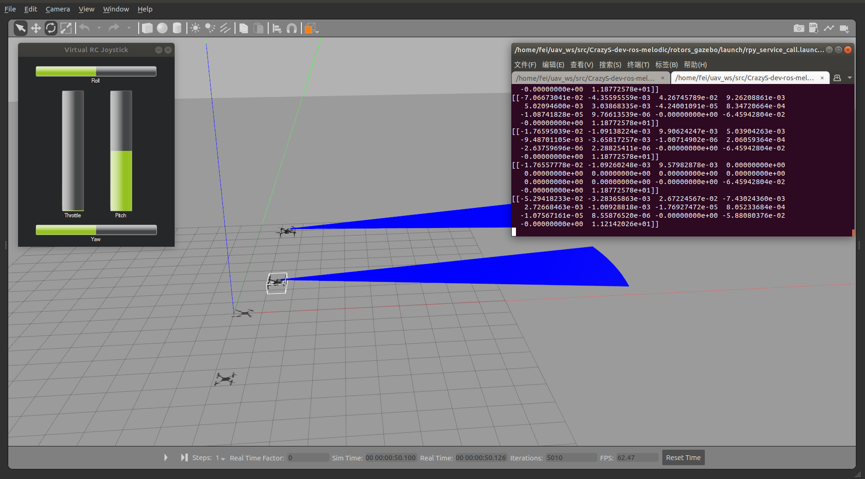

# This is a UAV gazebo simulator

> Conquerors M100 open source code

### Information


Thanks for the work of [Rotosr](https://github.com/ethz-asl/rotors_simulator) and [CrazyS](https://github.com/gsilano/CrazyS), we are happy to open this project as a tutorial for Conquerors team members.
<br>
### Dependances

- 1. Ubuntu18.04<br>
- 2. ROS Melodic<br>
- 3. gazebo 9<br>

### How to install

- 1.Download the project and unzip src.zip
```sh
$ git clone https://gitee.com/NEU_Conqueror/M100_open.git
$ cd M100_open/
$ unzip src.zip
``` 

- 2.make sure that u have installed the gazebo plugs,such as Ros_melodic version
```sh
$ rosdep install --from-paths src -i
$ sudo apt install ros-melodic-rqt-rotors ros-melodic-rotors-comm ros-melodic-mav-msgs ros-melodic-rotors-control
$ sudo apt install ros-melodic-rotors-gazebo ros-melodic-rotors-evaluation ros-melodic-rotors-joy-interface
$ sudo apt install ros-melodic-rotors-gazebo-plugins ros-melodic-mav-planning-msgs ros-melodic-rotors-description ros-melodic-rotors-hil-interface
$ rosdep update
$ catkin build
```

- 3.catkin make this project
```sh
$ catkin_make             tips:pls waiting for a long time...
```

- 4.Add sourcing to your `.bashrc` or `.zshrc` file
```sh
$ echo "source ~/M100_open/devel/setup.bash" >> ~/.bashrc
or if you use zsh
$ echo "source ~/M100_open/devel/setup.zsh" >> ~/.zshrc

$ source ~/.bashrc
or 
$ source ~/.zshrc

```

### How to use
- 5.Then u can use this command to run the code which will start an empty environment and neu_m100 will fly automaticly after a while.

```
$ roslaunch rotors_gazebo neu_m100_start.launch 
```


<!-------TODOadd empty work pic--------> 


After this you can use keyboard to control the uav, Maybe u should use this one:<br>

```
$ roslaunch rotors_gazebo neu_m100_with_keyboard.launch
```
<div align="center">
    
</div>

### Notice:

- 1.You can use `Tab` to completion the command you want  :)<br>
- 2.There is also a branch which was published in March 8 2020,which can show the detail of our M100 model :P<br>
- 3.This code is published in [Github](https://github.com/NEU-ROS-packages-for-DJI-M100-drone/Neu_M100_open) and [Gitee](https://gitee.com/NEU_Conqueror/M100_open)
# Hope you can enjoy it ~


### Team mambers
[yunfei](http://www.yunfei1996.xyz/) and [Lordon](https://tcloser.github.io/).
